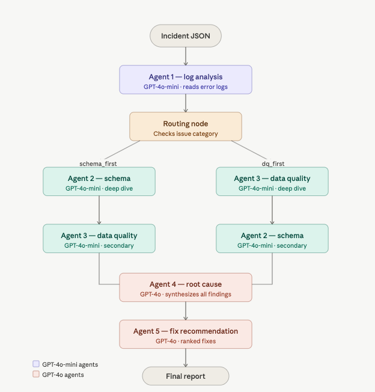

# Pipeline Debugger — Multi-Agent AI System for ETL Failure Diagnosis

A production-grade multi-agent AI system that diagnoses ETL/data pipeline failures through coordinated agent workflows. The system ingests pipeline metadata, logs, schema information, and data quality metrics, then uses five specialized agents orchestrated via LangGraph to identify root causes, assess impact, and recommend fixes.

---

## Demo

```bash
# Diagnose a single incident
python main.py scenarios/scenario_01.json

# Run all 20 scenarios
python main.py

# Run baseline vs multi-agent evaluation
python -m evaluation.eval
```

---

## Results

| Metric | Baseline (Single Agent) | Multi-Agent System |
|---|---|---|
| Root-cause accuracy | 90.0% | 95.0% |
| Correct / Total | 18/20 | 19/20 |
| Avg confidence | 0.91 | 0.95 |
| Avg time per incident | 1.86s | 9.19s |
| Accuracy improvement | — | +5.0% |

The multi-agent system outperforms a single GPT-4o-mini baseline on ambiguous boundary cases — particularly where log signals overlap with multiple possible root cause categories.

---

## System Architecture



The system uses a LangGraph state graph where each agent is a node. 
After log analysis, a routing node inspects the detected issue category 
and conditionally sends the case to either schema validation or data quality 
as the primary deep dive agent. Both agents always run — routing determines 
priority order. All findings converge at the root cause agent, which 
synthesizes evidence from all three upstream agents before the fix 
recommendation agent produces ranked, actionable fixes.

### Agent Design

| Agent | Model | Responsibility |
|---|---|---|
| Log Analysis | GPT-4o-mini | Reads error logs, extracts failure patterns, classifies issue category |
| Schema Validation | GPT-4o-mini | Compares expected vs actual schema, detects type drift and missing columns |
| Data Quality | GPT-4o-mini | Inspects null ratios, duplicate counts, row count mismatches |
| Root Cause | GPT-4o | Synthesizes all agent findings into a single coherent root cause |
| Fix Recommendation | GPT-4o | Recommends prioritized, actionable fixes based on confirmed root cause |

### Conditional Routing

After log analysis, the orchestrator routes to either schema or data quality as the primary deep dive agent based on the detected issue category:

- **Schema primary** — `type_cast_failure`, `missing_column`, `schema_mismatch`
- **DQ primary** — `null_spike`, `duplicate_records`, `join_explosion`, `late_arriving_data`, `partition_mismatch`
- **Both deep dives** — `unknown` errors trigger maximum investigation

Both agents always run regardless of routing — the flags control priority weighting in the root cause synthesis step.

---

## Tech Stack

- **Orchestration** — LangGraph
- **LLM** — GPT-4o (reasoning agents), GPT-4o-mini (evidence agents)
- **Structured outputs** — Pydantic v2
- **LLM framework** — LangChain
- **Language** — Python 3.11

---

## Project Structure

```
pipeline-debugger/
├── agents/
│   ├── log_analysis_agent.py
│   ├── schema_validation_agent.py
│   ├── data_quality_agent.py
│   ├── root_cause_agent.py
│   └── fix_recommendation_agent.py
├── orchestrator/
│   ├── graph.py              # LangGraph workflow
│   └── state.py              # Shared state TypedDict
├── models/
│   └── schemas.py            # Pydantic output schemas
├── scenarios/
│   └── scenario_01..20.json  # 20 incident scenarios
├── evaluation/
│   ├── baseline_agent.py     # Single-agent baseline
│   ├── eval.py               # Evaluation framework
│   └── eval_results.json     # Saved evaluation results
├── utils/
│   └── report_generator.py   # Incident report generator
├── reports/                  # Generated incident reports
├── main.py                   # CLI entry point
├── requirements.txt
└── .env.example
```

---

## Incident Scenarios

20 realistic pipeline failure scenarios covering all major ETL failure categories:

| Category | Count | Example |
|---|---|---|
| Type cast failure | 3 | String value in INTEGER column |
| Missing column | 3 | Upstream table dropped a column |
| Null spike | 3 | 40-70% nulls in critical fields |
| Schema mismatch | 3 | Column type changed to STRUCT/ARRAY |
| Join explosion | 2 | Non-unique join key causing row fanout |
| Duplicate records | 2 | Uniqueness constraint violations |
| Late arriving data | 3 | Missing partitions, empty source |
| Partition mismatch | 1 | Expected partitions not found in target |

Each scenario includes pipeline logs, expected and actual schemas, row counts, data quality metrics, SQL snippets, and ground truth labels for evaluation.

---

## Evaluation

The evaluation framework compares two systems on the same 20 scenarios:

- **Baseline** — single GPT-4o-mini agent receiving all information at once
- **Multi-agent** — full 5-agent LangGraph workflow

```bash
python -m evaluation.eval
```

Results are saved to `evaluation/eval_results.json`.

### Key finding

The multi-agent system's advantage is most pronounced on **boundary cases** — scenarios where log signals overlap with multiple root cause categories. For example, scenario 08 (marketing campaigns) where an empty source table was misclassified as a null spike by the baseline but correctly identified as late arriving data by the multi-agent system through deeper data quality analysis.

---

## Setup

```bash
# Clone the repo
git clone https://github.com/YOUR_USERNAME/pipeline-debugger.git
cd pipeline-debugger

# Create virtual environment
python -m venv venv
source venv/bin/activate  # Mac/Linux
venv\Scripts\activate     # Windows

# Install dependencies
pip install -r requirements.txt

# Add your OpenAI API key
cp .env.example .env
# Edit .env and add your key: OPENAI_API_KEY=your_key_here
```

---

## Known Limitations

- **LLM non-determinism** — results may vary slightly across runs on boundary cases due to probabilistic sampling even at temperature=0
- **Scenario 20 ambiguity** — the data warehouse snapshot scenario sits on the boundary between `schema_mismatch` and `type_cast_failure` — both systems misclassify it because the log signals for both categories are present simultaneously
- **Synthetic scenarios** — incident scenarios are hand-crafted to cover all failure categories; a production deployment would require an ingestion adapter to pull from real observability sources (Airflow metadata, schema registries, dbt test results)

---

## Future Improvements

- **Dynamic agent selection** — replace fixed routing with an orchestrator LLM that selects agents dynamically based on evidence
- **Confidence-based re-routing** — if root cause confidence is below 0.7, automatically re-run agents with different prompts
- **Parallel agent execution** — run schema and data quality agents in parallel to reduce latency
- **Memory across incidents** — store past incident diagnoses in a vector store to detect recurring patterns
- **Production ingestion adapter** — connect directly to Airflow, Unity Catalog, and dbt to auto-collect incident evidence
- **Streamlit demo UI** — upload incident JSON and visualize each agent's reasoning step by step

---

## Academic & Personal Context

**Personal Project**
This project was independently designed and built as a self-directed deep dive into agentic AI systems and LLM orchestration. It was not assigned — it was built out of curiosity and a desire to work on something that feels like a real engineering problem, not a tutorial.

It demonstrates:
- Multi-agent orchestration with LangGraph
- Structured LLM outputs with Pydantic
- Evidence-driven conditional routing
- Baseline vs multi-agent evaluation methodology
- Production-style project architecture

---

**Contact**

**Author:** Nishtha Joshi

**Program:** MS in Information Management

**Interests:** LLM Systems, Agentic AI, RAG, Fine-tuning, Applied ML Engineering
